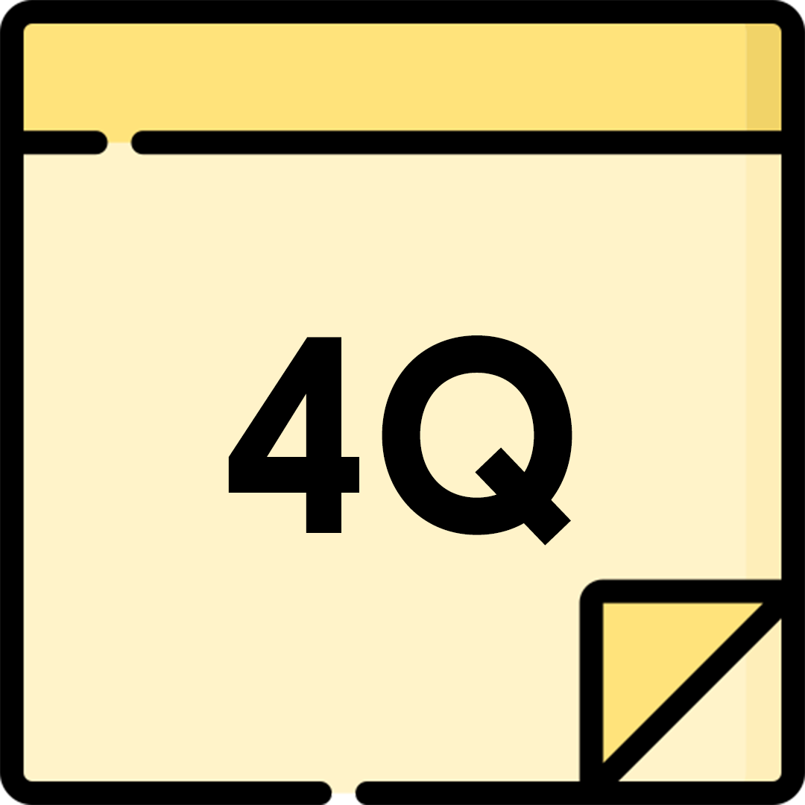
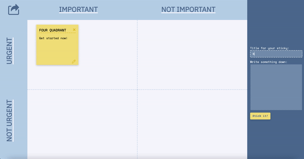

# FourQuadrant

FourQuadrant is a productivity web app that follows the Eisenhower method of time management. 

Check it out here -> https://www.fourquadrant.tech/

I'm adding this line for the sake of making a PR

## Get Started
Simply click the link above to create your board! No installation or sign-up needed.

## Features

* A board is divided into 4 quadrants: Important & Urgent, Not Important & Urgent, Important & Not Urgent, Not Important & Not Urgent.
* Create sticky notes for each task and drag them to the right quadrant based on priority.
* Sticky notes are customizable and draggable.
* Share the link of the board with others and collaborate in real time! 
